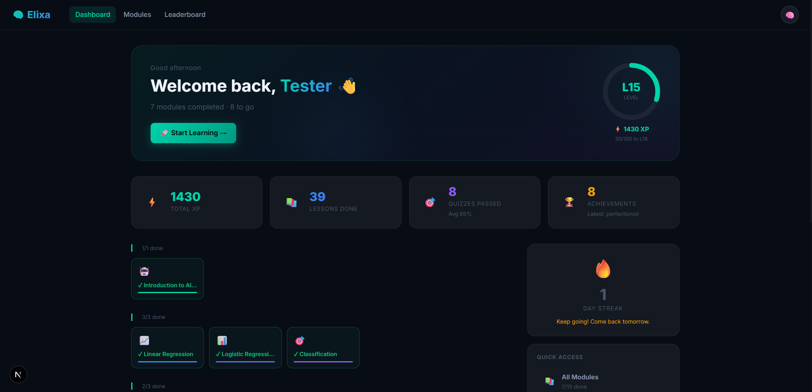
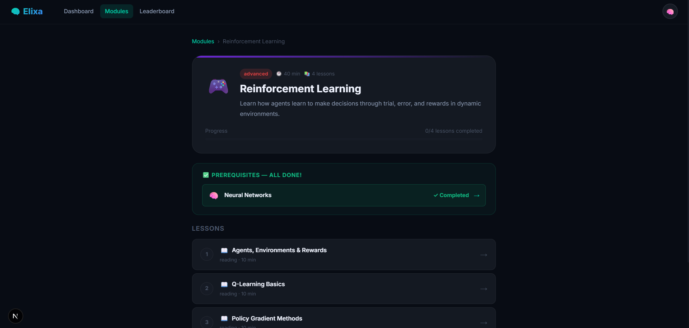
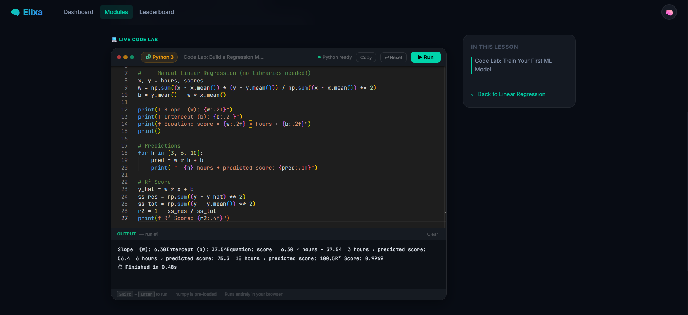
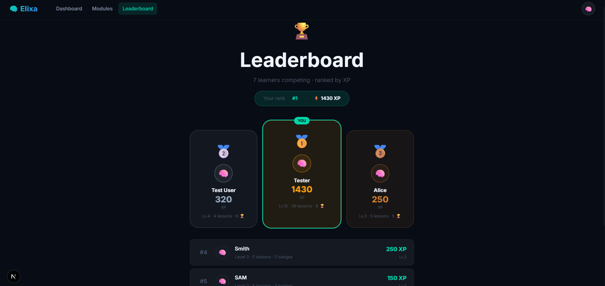

# Elixa

An interactive machine learning education platform. Elixa teaches ML concepts through structured lessons, embedded visualizations, a live Python code editor, and quiz-based assessments — all within a gamified learning environment.

---

## Screenshots

> Dashboard

<!-- screenshot: dashboard -->


> Module detail and lesson view

<!-- screenshot: lesson -->


> Live Python code playground (Pyodide + Monaco)

<!-- screenshot: playground -->


> Leaderboard

<!-- screenshot: leaderboard -->


---

## Features

**Learning**
- 15 structured modules across 5 ML categories (Fundamentals, Core ML, Data Handling, Advanced, Production)
- Lessons with text, callouts, code samples, key takeaways, and check-your-understanding prompts
- 6 embedded interactive visualizers: Linear Regression, Gradient Descent, Sigmoid, Decision Boundary, Overfitting, Neural Network
- Per-module quizzes with instant scoring and XP rewards
- Lesson completion tracking with progress bars

**Code Playground**
- Monaco Editor (VS Code engine) for Python editing
- Pyodide (CPython compiled to WebAssembly) — runs entirely in the browser, no server required
- numpy pre-loaded; stdout/stderr capture with live streaming output
- Shift+Enter shortcut to run; starter code seeded per lesson

**Gamification**
- XP and level system (100 XP per level)
- Daily streak tracking
- Achievement badges unlocked by completing lessons, quizzes, and reaching XP milestones
- Leaderboard with rank, XP, and badge count

**User**
- JWT authentication (register / login)
- Profile page with stats, achievement grid, module progress, and quiz history
- Persistent progress stored in MongoDB

---

## Repository Structure

```
Elixa/
├── backend/          Express API + MongoDB
├── frontend/         Next.js 16 / React 19 app
└── docs/             Architecture and curriculum documentation
```

---

## Prerequisites

- Node.js v18+
- A MongoDB Atlas cluster (free tier is sufficient)
- npm

---

## Setup

### 1. Clone

```bash
git clone https://github.com/your-username/elixa.git
cd elixa
```

### 2. Backend

```bash
cd backend
cp .env.example .env
```

Edit `.env`:

```env
MONGODB_URI=mongodb+srv://<user>:<pass>@cluster.mongodb.net/?appName=Elixa
JWT_SECRET=<random-string-at-least-32-chars>
FRONTEND_URL=http://localhost:3000
PORT=5000
NODE_ENV=development
```

```bash
npm install
npm run dev
```

The API runs at `http://localhost:5000`. The database is seeded automatically on first start.

### 3. Frontend

```bash
cd frontend
cp .env.local.example .env.local   # or create manually
```

`.env.local`:

```env
NEXT_PUBLIC_API_URL=http://localhost:5000
```

```bash
npm install
npm run dev
```

The frontend runs at `http://localhost:3000`.

---

## Reseed the Database

If lesson or module data has been updated, apply changes to the database without losing user data:

```
GET http://localhost:5000/api/seed
```

This drops and re-inserts only the `modules`, `lessons`, and `quizzes` collections. User accounts and progress are not affected.

---

## Tech Stack

| Layer | Technology |
|---|---|
| Frontend framework | Next.js 16 (App Router), React 19 |
| Styling | Vanilla CSS with CSS custom properties |
| Code editor | Monaco Editor (`@monaco-editor/react`) |
| Python runtime | Pyodide v0.25.1 (CPython + WebAssembly) |
| Backend | Express 5 |
| Database | MongoDB Atlas (via native `mongodb` driver) |
| Authentication | JWT (`jsonwebtoken`) + bcrypt |
| Deployment | Vercel (frontend + backend) |

---

## API Overview

| Method | Endpoint | Description |
|---|---|---|
| POST | `/api/auth/register` | Create account |
| POST | `/api/auth/login` | Login, returns JWT |
| GET | `/api/auth/me` | Current user + progress |
| GET | `/api/modules` | All modules with user progress |
| GET | `/api/modules/:id` | Module detail + lessons |
| GET | `/api/lessons/:id` | Lesson content |
| POST | `/api/lessons/:id/complete` | Mark lesson complete, award XP |
| GET | `/api/quiz/:id` | Quiz questions |
| POST | `/api/quiz/:id/submit` | Submit answers, get score |
| GET | `/api/progress` | Full user progress record |
| GET | `/api/leaderboard` | Top users by XP |
| GET | `/api/achievements` | User achievements |

---

## License

MIT
