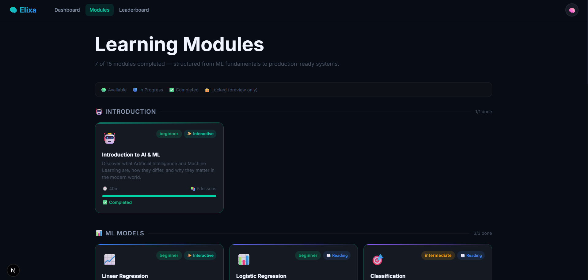
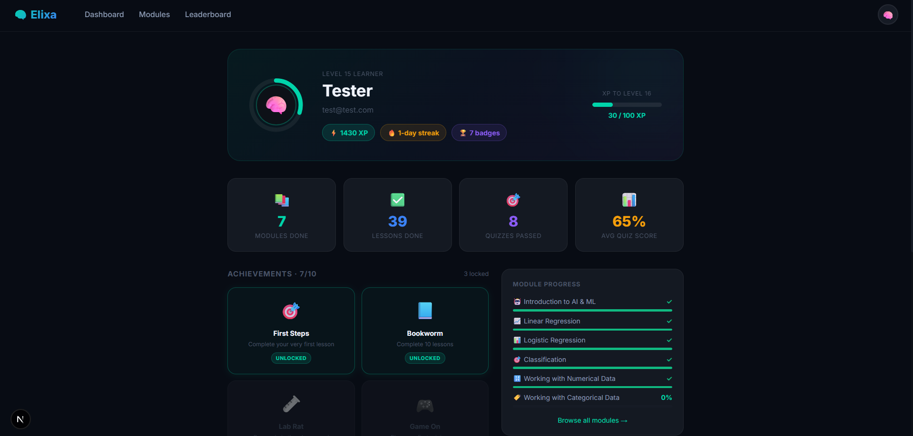

# Elixa — Frontend

Next.js 16 application (App Router) providing the learner-facing interface for the Elixa ML education platform.

---

## Screenshots

> Dashboard with XP, streak, and module progress

<!-- screenshot -->


> Module page with lesson list and type badges

<!-- screenshot -->


> Lesson page with embedded interactive and code lab

<!-- screenshot -->


> Profile page with achievements and quiz history

<!-- screenshot -->


---

## Setup

### Prerequisites

- Node.js v18+
- Backend API running (see `../backend/README.md`)

### Install and run

```bash
npm install
```

Create `.env.local` in this directory:

```env
NEXT_PUBLIC_API_URL=http://localhost:5000
```

```bash
npm run dev        # development server at http://localhost:3000
npm run build      # production build
npm run start      # serve production build
```

---

## Project Structure

```
frontend/
├── app/
│   ├── dashboard/          User dashboard
│   ├── leaderboard/        XP leaderboard
│   ├── login/              Authentication
│   ├── register/           Account creation
│   ├── modules/            Module list and detail pages
│   │   └── [moduleId]/
│   │       ├── page.js     Module detail (lesson list)
│   │       └── [lessonId]/
│   │           └── page.js Lesson renderer
│   ├── profile/            User profile, stats, achievements
│   ├── quiz/[quizId]/      Quiz runner
│   ├── globals.css         Global design system (CSS custom properties)
│   ├── layout.js           Root layout with metadata
│   └── page.js             Landing page
├── components/
│   ├── Navbar.jsx          Navigation with user dropdown
│   ├── Toast.jsx           Achievement notification toasts
│   ├── interactive/        Embedded interactive components
│   │   ├── LinearRegressionSlider.jsx
│   │   ├── GradientDescentViz.jsx
│   │   ├── SigmoidExplorer.jsx
│   │   ├── OverfittingExplorer.jsx
│   │   ├── NeuralNetworkViz.jsx
│   │   ├── DecisionBoundaryExplorer.jsx
│   │   └── CodePlayground.jsx
└── lib/
    └── api.js              API client (token management, all fetch calls)
```

---

## Pages

| Route | Description |
|---|---|
| `/` | Landing page |
| `/login` | Login form |
| `/register` | Registration form |
| `/dashboard` | Overview: XP, streak, module grid, achievements |
| `/modules` | All 15 modules grouped by category |
| `/modules/[moduleId]` | Module detail: lesson list, progress, lock state |
| `/modules/[moduleId]/[lessonId]` | Lesson content with embedded interactive where applicable |
| `/quiz/[quizId]` | Multi-question quiz with scoring |
| `/leaderboard` | Ranked user list with podium for top 3 |
| `/profile` | Stats, achievement grid, module progress, quiz history |

---

## Interactive Components

Each component is dynamically imported (`ssr: false`) and embedded directly inside the lesson renderer based on `lesson.type` or a `lessonId → component` map.

| Component | Lesson type | Trigger |
|---|---|---|
| `LinearRegressionSlider` | `interactive` | `linreg-params-exercise` |
| `GradientDescentViz` | `interactive` | `linreg-gradient-descent` |
| `SigmoidExplorer` | `interactive` | `logreg-sigmoid` |
| `DecisionBoundaryExplorer` | `interactive` | `class-confusion-matrix`, `class-metrics` |
| `OverfittingExplorer` | `game` | Any lesson with `type: 'game'` |
| `NeuralNetworkViz` | `interactive` | `nn-intro` |
| `CodePlayground` | `code-lab` | Any lesson with `type: 'code-lab'` |

### CodePlayground — Technical Notes

- **Editor**: Monaco Editor (`@monaco-editor/react`) — VS Code engine with Python syntax highlighting, line numbers, bracket colorization
- **Runtime**: Pyodide v0.25.1 loaded from CDN via a `<script>` tag injected once at first use, then cached by the browser
- **Execution**: `pyodide.runPythonAsync(code)` with stdout/stderr hooked via `setStdout`/`setStderr`
- **Keyboard shortcut**: Shift+Enter to run (wired via Monaco's `addCommand` on editor mount, using a ref to avoid stale closures)
- **Starter code**: Extracted from the lesson's `{ type: 'code' }` section at render time

---

## Design System

All design tokens are CSS custom properties defined in `globals.css`:

```css
--bg-primary, --bg-secondary, --bg-card, --bg-tertiary
--accent, --accent-soft, --border, --border-accent
--text-primary, --text-secondary, --text-muted
--radius-sm, --radius-md, --radius-lg, --radius-xl, --radius-full
--green, --orange, --blue, --purple, --red
```

Key utility classes: `container`, `card`, `btn`, `btn-primary`, `btn-ghost`, `xp-badge`, `progress-bar`, `spinner`, `animate-fade`, `stagger-children`, `grid-4`, `lesson-content`.

---

## Dependencies

| Package | Purpose |
|---|---|
| `next` 16 | Framework (App Router, server components, dynamic imports) |
| `react` / `react-dom` 19 | UI |
| `@monaco-editor/react` 4.7 | VS Code editor in the browser |

Pyodide is loaded from CDN at runtime — it is not an npm dependency.
